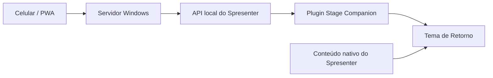

# Stage Companion

**Stage Companion** é uma integração para o **Spresenter** criada para comunicação rápida entre recepção/portaria, equipe técnica e a tela de Retorno do palco.

A solução combina **plugin Spresenter + servidor Windows + PWA para celular + tema de Retorno**. Visitantes, oportunidades de louvor, alertas, veículos e mensagens podem ser enviados pela rede local sem expor a chave da API nos celulares.

> **Estado:** desenvolvimento/teste. A revisão atual possui testes automatizados, mas ainda deve ser validada em uso real antes de ser tratada como release estável para a comunidade.

## Versão atual

| Componente | Versão |
|---|---|
| Projeto | **08G-C3** |
| Plugin | **0.3.56** |
| Servidor/PWA | **0.8G-R9** |
| Tema | **Retorno — Stage Companion 08G C3** |
| Spresenter mínimo | **0.3.48** |
| Plugin ID | `com.stagecompanion.dev` |

## O que o projeto faz

- **Visitantes** — lista em edição e publicação no Retorno.
- **Oportunidade de Louvor** — lista independente, também publicada no Retorno.
- **Alerta** — mensagens rápidas configuráveis.
- **Veículo** — placa em destaque, modelo/cor e problema informado pelo operador.
- **Mensagem** — texto livre e atalhos configuráveis.
- **Estrobo** — reforço visual opcional para Alerta, Veículo e Mensagem; padrão atual de 30 segundos.
- **PWA** — acesso por QR Code para voluntários na mesma rede.
- **Servidor Windows** — autostart, bandeja, detecção de IP/porta e proteção local do token.
- **Personalização** — identidade da igreja, fundo, blur e ofuscamento da PWA.
- **Retorno inteligente** — Visitantes/Louvor recolhem durante apresentação nativa e retornam depois.
- **Vídeo no Retorno** — a C3 inclui tratamento de `main-video` para o caso observado de container preto.

## Arquitetura



O celular **não recebe a chave da API**. Ele acessa apenas o servidor Stage Companion na rede local. O servidor mantém a configuração no PC e chama as actions do plugin por meio da API do Spresenter.

## Instalação rápida

1. Instale/atualize `StageCompanion-DEV-Teste08G-C3.zip` no Spresenter.
2. Importe `Retorno-StageCompanion-08G-C3.spresenter-theme.json`.
3. Aplique o tema a **cada saída de Retorno** usada.
4. Execute `StageCompanion-Servidor-08G-R9.exe` no PC de projeção.
5. Em instalação nova, configure a chave da API com escopo `plugins:invoke`.
6. Abra **Voluntários**, confirme IP/porta/QR e acesse a PWA pelo celular.

Para atualização de uma versão anterior, **não desinstale o plugin** apenas para atualizar. A revisão atual foi preparada para preservar/migrar estado e reaproveitar a configuração existente quando possível.

Guia detalhado: **[docs/INSTALLATION.md](docs/INSTALLATION.md)**.

## Documentação

| Documento | Assunto |
|---|---|
| [docs/README.md](docs/README.md) | Índice completo da documentação |
| [docs/OVERVIEW.md](docs/OVERVIEW.md) | Visão geral e recursos |
| [docs/INSTALLATION.md](docs/INSTALLATION.md) | Instalação e atualização |
| [docs/USER-GUIDE.md](docs/USER-GUIDE.md) | Uso durante o culto |
| [docs/INTERFACE.md](docs/INTERFACE.md) | Interface atual |
| [docs/PWA.md](docs/PWA.md) | PWA e navegação móvel |
| [docs/RETURN-THEME.md](docs/RETURN-THEME.md) | Tema e layout do Retorno |
| [docs/ARCHITECTURE.md](docs/ARCHITECTURE.md) | Arquitetura técnica |
| [docs/API-SECURITY.md](docs/API-SECURITY.md) | API, rede e segurança |
| [docs/DEVELOPMENT.md](docs/DEVELOPMENT.md) | Build, testes e desenvolvimento |
| [docs/TROUBLESHOOTING.md](docs/TROUBLESHOOTING.md) | Solução de problemas |
| [docs/ROADMAP.md](docs/ROADMAP.md) | Validações e próximos passos |
| [CONTRIBUTING.md](CONTRIBUTING.md) | Como colaborar |
| [SECURITY.md](SECURITY.md) | Política de segurança |
| [CHANGELOG.md](CHANGELOG.md) | Alterações da revisão atual |

## Estrutura do projeto

```text
.github/workflows/   CI / build Windows
.bootstrap/          fonte compactada reconstruída pelo CI
plugin/              manifest público do plugin
server/app/          arquivos públicos da PWA
themes/              tema do Retorno
tests/               testes automatizados
docs/                documentação completa
```

O workflow `Build Stage Companion` reconstrói o código-fonte completo, compila o servidor Windows x64, empacota o plugin, copia o tema, executa os testes e publica os artefatos do job.

## Segurança

A PWA foi projetada para uso em **rede local confiável**. Não exponha a porta do Stage Companion diretamente à internet. Nunca publique a chave da API em screenshots, issues, commits ou QR Codes.

Se um token for exposto, revogue-o e gere outro.

## Desenvolvimento e validação

Os testes atuais cobrem regressões importantes como migração C2→C3, Veículo, Estrobo, vídeo, ocultação/restauração das listas e alternância da faixa. Mesmo assim, mudanças em tema, mídia e múltiplas saídas precisam de validação no Spresenter real.

## Licença

A licença pública definitiva do projeto ainda não foi definida. Antes de redistribuição externa, consulte o mantenedor e acompanhe a futura inclusão de um arquivo `LICENSE`.
