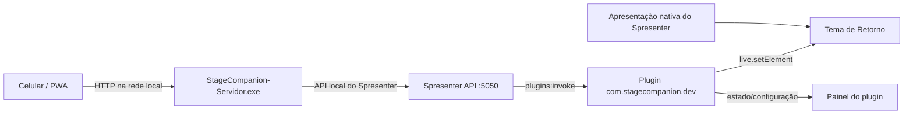
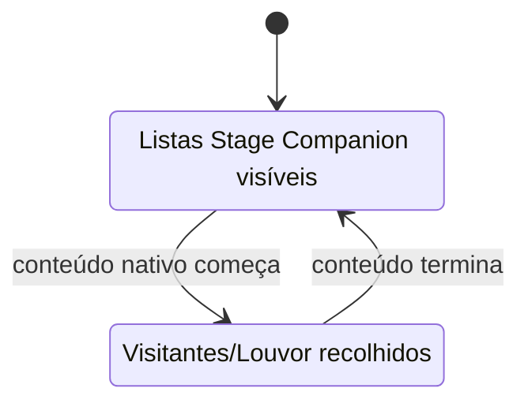

# Arquitetura

## Visão geral

O Stage Companion é dividido em componentes separados para respeitar o modelo de plugins do Spresenter e, ao mesmo tempo, oferecer acesso simples pela rede local.



## 1. Plugin Spresenter

O plugin atual usa:

```text
ID: com.stagecompanion.dev
Versão: 0.3.56
MinAppVersion: 0.3.48
Background: true
```

Permissões declaradas no manifest atual:

```text
outputs:read
live:read
live:write
```

O plugin roda lógica em segundo plano, registra ações para chamadas externas e controla os elementos do tema por ID.

### Live elements

A integração visual usa patches em elementos do tema. A maior parte dos elementos controlados tem prefixo `sc-`.

Exemplos:

```text
sc-alert-text
sc-vehicle-detail-text
sc-vehicle-problem-text
sc-visitors-text
sc-worship-text
sc-flash
```

A revisão C3 também pode atualizar o elemento nativo `main-video` para corrigir a fonte de um vídeo no Retorno.

## 2. Ações do plugin

O servidor chama ações registradas pelo plugin através do endpoint do Spresenter:

```text
POST /api/v1/plugins/com.stagecompanion.dev/requests/<acao>
```

O token usado pelo servidor precisa do escopo `plugins:invoke`.

A revisão atual expõe ações usadas pela PWA e pelo servidor, incluindo estado/configuração e envio de conteúdo. Entre as ações validadas pelos testes atuais estão:

```text
pwa-state
pwa-config
pwa-send-vehicle
pwa-send-message
```

O projeto também usa ações correspondentes para Visitantes, Oportunidade de Louvor, Alertas, registro do servidor e controles de limpeza/visibilidade. Ao alterar nomes de ações, servidor e plugin precisam ser atualizados juntos.

## 3. Servidor Windows

O servidor é um executável separado porque a lógica do plugin não deve funcionar como um servidor HTTP local completo nem depender de acesso direto ao sistema operacional.

Responsabilidades do EXE:

- hospedar a PWA;
- detectar o IP LAN atual;
- selecionar uma porta local disponível;
- armazenar a configuração da API;
- proteger o token no perfil do usuário do Windows;
- encaminhar ações da PWA ao Spresenter;
- registrar o endereço atual no plugin;
- iniciar automaticamente com o Windows;
- operar pela bandeja do sistema.

## 4. Fluxo de rede

### Celular → servidor

O celular acessa algo como:

```text
http://192.168.2.59:8090/
```

Esse endereço contém apenas IP e porta. Não contém token.

### Servidor → Spresenter

O servidor usa normalmente:

```text
http://127.0.0.1:5050/
```

A autenticação é feita no próprio PC.

### Spresenter → plugin

O Spresenter recebe a chamada autenticada e despacha a ação para o plugin `com.stagecompanion.dev`.

## 5. Estado e configuração

O projeto separa **configuração** de **estado operacional**.

Configuração inclui informações como:

- nome da igreja;
- presets de alerta;
- atalhos de mensagem;
- tempo de Estrobo;
- preferências visuais;
- fundo da PWA.

Estado operacional inclui:

- listas em edição;
- listas publicadas;
- aviso atual;
- dados do veículo;
- visibilidade da faixa.

A C3 contém migração do estado da revisão C2 para o novo formato de Veículo, separando placa, modelo/cor e problema.

## 6. Observação da apresentação nativa

O plugin assina eventos `live` e `state` da saída usada pelo Retorno. Quando detecta conteúdo nativo ativo, ele reavalia a visibilidade de Visitantes e Oportunidade de Louvor.

Fluxo esperado:



Alertas temporários podem continuar visíveis durante a projeção.

## 7. Reparo do vídeo

Quando a camada ativa contém um asset do tipo `video`, a C3 usa o GUID do asset para montar uma fonte semelhante a:

```text
/assets/<guid>
```

Essa fonte é aplicada a `main-video`. Quando a projeção termina, o plugin devolve a fonte esperada pelo tema para o fluxo normal de slides.

Esse mecanismo existe especificamente para resolver o caso observado de um bloco preto no Retorno durante reprodução de vídeo.

## 8. Segurança do token

O token fica no computador e é protegido usando mecanismos do Windows associados ao usuário atual. A PWA não recebe o token.

Essa separação é parte central da arquitetura:

```text
Celular: sem token
Servidor Windows: token protegido
Spresenter: valida o token
Plugin: executa somente as ações recebidas pelo Spresenter
```

## 9. Build e distribuição

O repositório possui GitHub Actions. O workflow:

1. reconstrói o código-fonte completo a partir do bootstrap versionado;
2. expande o arquivo em `src/` durante o job;
3. compila o servidor Windows x64 com Go;
4. empacota o plugin em ZIP;
5. copia o tema;
6. executa testes;
7. publica os artefatos do workflow.

A pasta `.bootstrap/` existe porque a revisão atual foi publicada no repositório com o código completo compactado e reconstruído durante o CI. Em uma reorganização futura, o projeto pode migrar para uma árvore-fonte totalmente expandida no próprio repositório.

## 10. Princípios para futuras mudanças

Qualquer revisão deve preservar estes contratos:

- o celular não recebe a chave da API;
- o plugin mantém o mesmo ID durante atualizações compatíveis;
- IDs `sc-*` do tema e código precisam permanecer sincronizados;
- o tema não deve eliminar elementos nativos necessários ao Spresenter;
- atualizações não devem exigir nova chave sem motivo real;
- PWA, servidor, plugin e tema devem ser versionados como um conjunto compatível.
